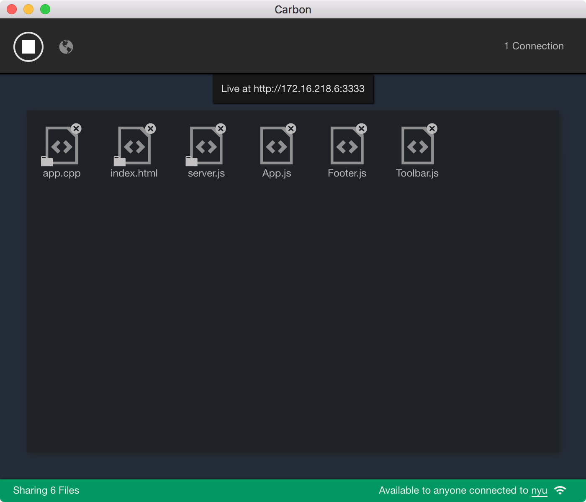
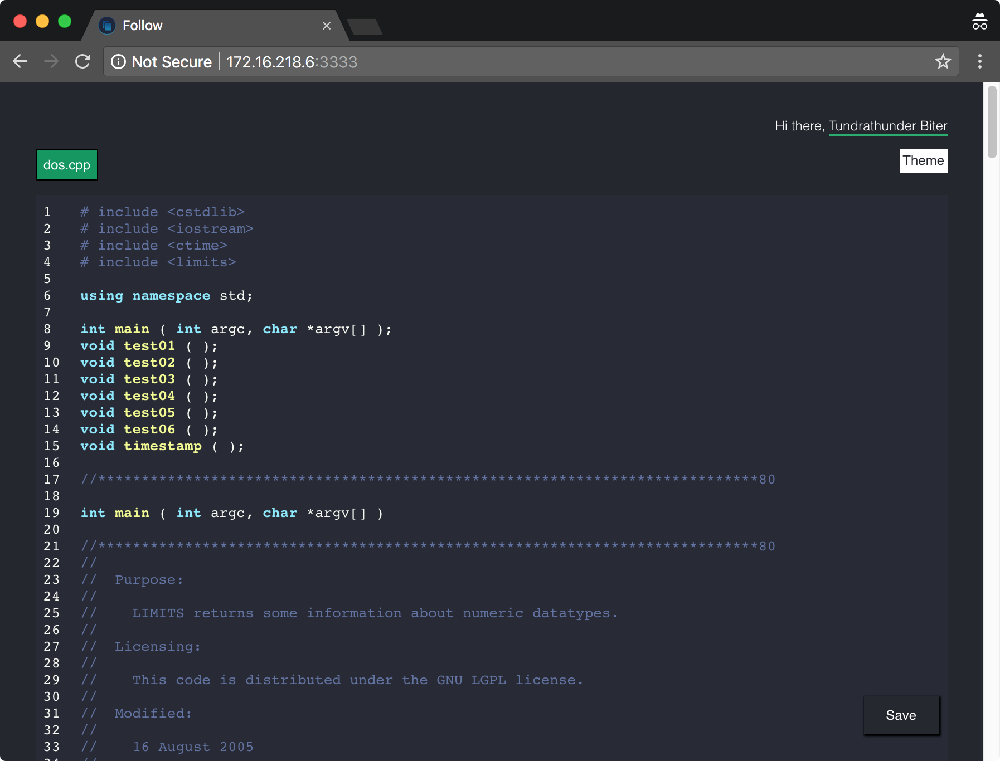

# Carbon

Carbon *(from [Carbon Paper](https://en.wikipedia.org/wiki/Carbon_paper))* is a desktop app to share files. What makes Carbon different is that it watches files for changes and updates all connected clients in real time. It was originally designed to use when teaching programming, showing code or when you need to share files with a live audience.

You can use it to share files only in your local network or you can enable *world mode* to create a public access domain using [ngrok](https://ngrok.com/).

Carbon is available for macOS, Linux and Windows (untested).



## Usage

Download the latest release [here](https://drive.google.com/drive/folders/1LAX4kxcX3NA5iSuRRB6RgwX4M0kMEpEt?usp=sharing). Open the app, drop files into the main window and click the start button. This will enable a server over the local network. Clients on the same network can connect with the supplied URL. If your firewall blocks your server or you have issues inside the network, you can enable *world mode* by clicking in the globe icon, that will create a new URL that's available to anyone. Use with caution!

Every client that connects to the supplied URL will have the same files dropped in the app and they will update live using sockets.


You can use Carbon with any text editor. Updates will be sent to clients whenever files changes are detected. For character level updates you can use different settings depending on the editor of your choice:

- VSCode: Enable the [Auto Save](https://code.visualstudio.com/docs/editor/codebasics#_save-auto-save) functionality for millisecond saves with `files.autoSave: afterDelay`.
- Atom: Install the [auto-save on Change](https://atom.io/packages/autosave-onchange) plugin and set the amount of time to auto-save.
- Sublime: Install the [auto-save](https://packagecontrol.io/packages/auto-save) plugin that saves the current file after every modification.

## Client

Every connected user receives a page with a socket connection to the server. This pages allows for save options and theme personalization.



## Develop

Carbon was made with [electron-react-boilerplate](https://github.com/chentsulin/electron-react-boilerplate) that uses: [Electron](http://electron.atom.io/), [React](https://facebook.github.io/react/), [Redux](https://github.com/reactjs/redux), [React Router](https://github.com/reactjs/react-router), [Webpack](http://webpack.github.io/docs/), and [React Transform HMR](https://github.com/gaearon/react-transform-hmr).

The client page is built with [create-react-app](https://github.com/facebookincubator/create-react-app)

To develop the electron app:
```
sudo yarn start
```

To package the app:
```
sudo yarn package
```

To build the client side:
```
cd client
yarn start
```


## Licence

TBD
